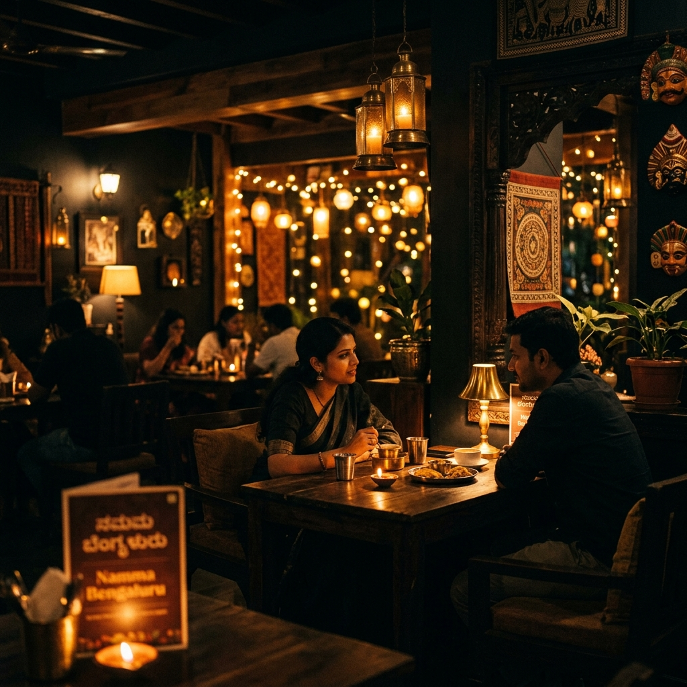

# ☕ Lassi Lehar — Official Website

> Sandur's most beloved café at Vijaya Circle. Fresh lassi, stone-fired pizza, and warm hospitality in the heart of Karnataka.



---

## 🗂 Project Structure

```
lassi-lehar/
├── backend/               ← Express.js API server (Port 3001)
│   ├── server.js
│   ├── routes/
│   │   ├── menu.js        ← GET /api/menu
│   │   └── contact.js     ← POST /api/contact
│   └── package.json
│
├── src/                   ← React frontend (Vite, Port 5173)
│   ├── components/
│   │   ├── Navbar.jsx
│   │   ├── Hero.jsx
│   │   ├── MarqueeStrip.jsx
│   │   ├── About.jsx
│   │   ├── Menu.jsx
│   │   ├── Reviews.jsx
│   │   ├── Gallery.jsx
│   │   ├── Location.jsx
│   │   ├── CTA.jsx
│   │   ├── Footer.jsx
│   │   └── WhatsAppFloat.jsx
│   ├── App.jsx
│   ├── main.jsx
│   └── index.css
│
├── public/
│   └── images/            ← AI-generated food & café photos
│
├── index.html
├── vite.config.js
└── package.json
```

---

## 🚀 Getting Started

### Prerequisites
- [Node.js](https://nodejs.org) v18 or above
- npm (comes with Node.js)

---

### 1. Install Frontend Dependencies

```bash
cd lassi-lehar
npm install
```

### 2. Install Backend Dependencies

```bash
cd backend
npm install
```

---

## ▶️ Running the Project

### Start Frontend (Vite Dev Server)

```bash
# From project root: lassi-lehar/
npm run dev
```
Opens at → **http://localhost:5173**

---

### Start Backend (Express API)

```bash
# From backend folder: lassi-lehar/backend/
node server.js
```
API runs at → **http://localhost:3001**

---

## 🔌 API Endpoints

| Method | Endpoint | Description |
|---|---|---|
| `GET` | `/api/health` | Server health check |
| `GET` | `/api/menu` | Returns all menu items as JSON |
| `GET` | `/api/menu?cat=pizza` | Filter by category |
| `POST` | `/api/contact` | Submit a contact/enquiry |

### Example — Get Menu
```bash
curl http://localhost:3001/api/menu
```

### Example — Send Contact Enquiry
```bash
curl -X POST http://localhost:3001/api/contact \
  -H "Content-Type: application/json" \
  -d '{"name":"Rajan","phone":"9876543210","message":"Can I book for 10 people?"}'
```

---

## 🛠 Tech Stack

| Layer | Technology |
|---|---|
| **Frontend** | React 18, Vite, Vanilla CSS |
| **Backend** | Node.js, Express.js |
| **Images** | AI-generated (14 food & café photos) |
| **Fonts** | Cormorant Garamond, Inter (Google Fonts) |
| **Deployment** | Vercel (frontend) + Railway/Render (backend) |

---

## 📦 Build for Production

```bash
# Build the frontend
npm run build
# Output → dist/ folder (ready to deploy)
```

---

## 📍 About Lassi Lehar

**Location:** Vijaya Circle, Sandur, Karnataka — 583 119  
**Phone:** +91 98765 43210  
**Email:** hello@lassilehar.in  
**Hours:** Mon–Sun, 11:00 AM – 11:00 PM

---

## 📄 License

© 2026 Lassi Lehar. All rights reserved.
